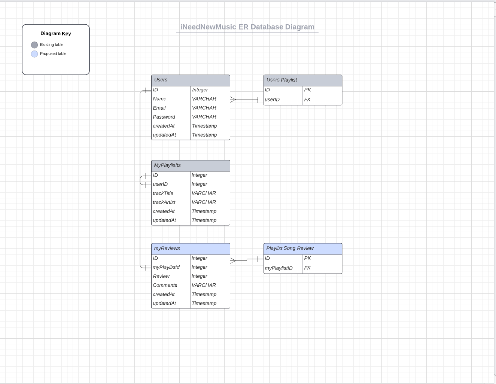
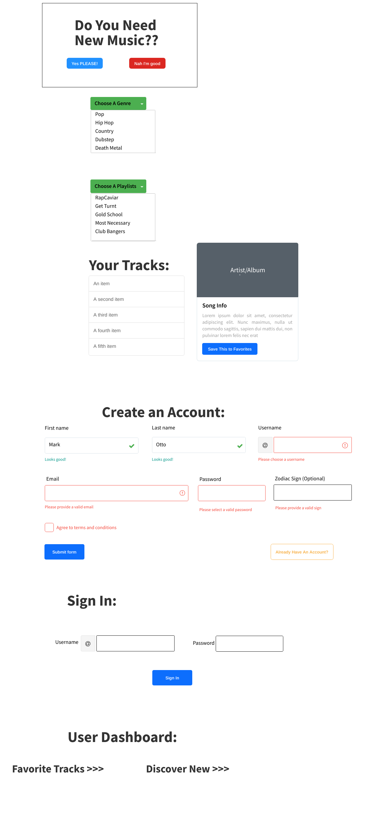

# Project 2 Planning

Fork & Clone this repo.

## Part 1

- [ ] Review the [Project 2 requirements](https://romebell.gitbook.io/seirfx-621/projects/project-2)

- [ ] Check out some [examples](https://romebell.gitbook.io/seirfx-621/projects/past-projects/project2)

- [ ] In this space below, list **THREE** ideas for your Project 2. For each idea, include [user stories](https://www.atlassian.com/agile/project-management/user-stories) for each idea and a link to the API(s) you want to use for it.

--------------------------------------------------------
1. Spotify music search
2. Spotify Playlist creator
3. ESPN Team Builder
---------------------------------------------------------

- [x] Make a PR when you're done!

---

## Part 2

In the space below:
* either embed or link a completed ERD for your approved P2 idea
* if there are any changes/additions to your user stories, place your full set of revised user stories here
* either embed or link wireframes for every page of your app

----------------------------------------------------------
### ERD

----------------------------------------------------------
### User Stories
1. As a User, I want to Signup so that I can utilize a profile
2. As a User, I want to Login so that I can add songs to personal playlists
3. As a User, I want to browse Spotify genres so I can look at the Spotify playlists 
4. As a User, I want to browse Spotify playlists so that I can view songs within that playlist
5. As a User, I want to view information on a song within a playlist
6. As a User, I want to go to the spotify URL to play the song
7. As a User, I want to be able to add a song to my personal playlist
8. As a User, I want to be able to review songs in my personal playlist
9. As a User, I want to be able to edit the name and artist of any song in my playlist
10. As a User, I want to be able to delete songs out of my personal playlist
11. As a non-logged in User, I want to be able to browse Spotify genres so I can look at the Spotify playlists 
12. As a non-logged in User, I want to browse Spotify playlists so that I can view songs within that playlist
13. As a non-logged in User, I want to view information on a song within a playlist
14. As a non-logged in User, I want to go to the spotify URL to play the song


----------------------------------------------------------
### Wireframes

----------------------------------------------------------
### Dev Notes
Get a list of Categories
- https://api.spotify.com/v1/browse/categories/
Get a list of Category Playlists
- https://api.spotify.com/v1/browse/categories/{category_id}/playlists
Get a playlist's items (tracks)
- https://api.spotify.com/v1/playlists/{playlist_id}/tracks
Get a track
- https://api.spotify.com/v1/tracks/{id}

----------------------------------------------------------

Make a PR when you're done!


## Requirements Inside `Project Board`

`card` FUNDAMENTALS
```
### FUNDAMENTALS
- [x] Deployed (e.g. Heroku)
- [x] Site has basic functionality related to its goal
- [x] At least 2 GET routes (other than auth)
- [x] At least 1 POST route
- [x] At least 1 DELETE route
- [x] At least 1 PUT route
```

`card` SUFFICIENT DIFFICULTY
```
### SUFFICIENT DIFFICULTY: At least 1 of the following: 
- [x] Use of an API
- [x] Advanced Database Relationships
- [ ] Sockets
- [ ] Scraping
- [x] OAuth
- [x] Other
```

`card` AUTH/SECURITY

```
### AUTH/SECURITY (Mostly From Template Boilerplate)
- [x] Log in works (required: boilerplate or better)
- [x] Sensible error messages for bad login info  (boilerplate or better)
- [x] Passwords hashed in database
- [x] Passwords in form are input type="password" (dots)
- [x] Password verification is checked
- [x] Can't sneak edit/delete data that I don't own by typing in random ids
```
`card` GITHUB USAGE
```
### GITHUB USAGE
- [x] Appropriate Use of Github
- [x] `README` is included and is descriptive
- [x] `.gitignore` properly set up
- [x] No API keys in Github code (used a .env file)
- [x] Multiple commits per day
- [x] Repo up on day 1 of project week or sooner
- [x] `README` has *Installation Instructions*
```

`card` DATABASE USAGE
```
### DATABASE USAGE
- [x] At least 2 Models other than join tables (required)
- [x] Relationships were set up appropriately between models
- [x] Avoided global variables, storing data in files, etc
- [x] No raw file/image data stored in database, etc
```

`card` CODE STYLE
```
### CODE STYLE
- [x] Generally DRY code / No enormous files
- [x] Proper indentation (or mostly pretty good!)
- [x] Naming conventions kept
- [x] No glaring logic errors
```
`card` USER EXPERIENCE
```
### USER EXPERIENCE
- [x] Effort was put into design
- [x] No broken links (server errors or 404s)
- [x] Typing a purposely bad link renders an error ejs page
- [x] Content is responsive to screen size changes
- [x] No glaring alignment or grid errors
```

# Detailing My Project

## Utilizing `Express Authentication`

Express authentication template using Passport + Flash messages + custom middleware

## What My Project Includes

* Sequelize user model / migration
* Settings for PostgreSQL
* Passport and passport-local for authentication
* Sessions to keep user logged in between pages
* Flash messages for errors and successes
* Passwords that are hashed with BCrypt
* EJS Templating and EJS Layouts

### User Model

| Column Name | Data Type | Notes |
| --------------- | ------------- | ------------------------------ |
| id | Integer | Serial Primary Key, Auto-generated |
| name | String | Must be provided |
| email | String | Must be unique / used for login |
| password | String | Stored as a hash |
| createdAt | Date | Auto-generated |
| updatedAt | Date | Auto-generated |

### Playlist Model

| Column Name | Data Type | Notes |
| --------------- | ------------- | ------------------------------ |
| id | Integer | Serial Primary Key, Auto-generated |
| userID | Integer | Foreign Key attached to User Model |
| trackArtist | String | Pulled from Spotify API |
| trackTitle | String | Pulled from Spotify API |
| createdAt | Date | Auto-generated |
| updatedAt | Date | Auto-generated |


### Review Model

| Column Name | Data Type | Notes |
| --------------- | ------------- | ------------------------------ |
| id | Integer | Serial Primary Key, Auto-generated |
| myPlaylistId | Integer | Foreign Key attached to Playlist Model |
| review | Integer | Must be Provided |
| comments | String | Must be Provided |
| createdAt | Date | Auto-generated |
| updatedAt | Date | Auto-generated |


### App Routes

| Method | Path | Location | Purpose |
| ------ | ---------------- | -------------- | ------------------- |
| GET | / | server.js | Renders Home Page - passes up request |
| GET | /auth/login | auth.js | Login form |
| GET | /auth/signup | auth.js | Signup form |
| POST | /auth/login | auth.js | Login user |
| POST | /auth/signup | auth.js | Creates User |
| GET | /auth/logout | auth.js | Removes session info |
| GET | /genre | server.js | Requests Genres from Spotify API then Serves Up a List of Genres the User Can Choose From - passes up res.data.categories |
| GET | /playlist | server.js | Requests Playlists from Spotify API Based on the Users req.query.genre selection. User Selects Playlists Based on Genre |
| GET | /tracks | server.js | Grabs Data Based on the Users req.query.playlist Selection. Serves Up All Tracks in a Playlist |
| GET | /track | server.js | Serves Up Individual Track Information Based on Users req.query.track Selection. Also Allows for Adding Track to Personal Playlist |
| POST | /profile-add | server.js | Creates a New Entry in myPlaylist Table |
| PUT | /profile/:trackid | server.js | Updates a Track Entry in myPlaylist Table |
| GET | /profile/:trackid | server.js | Deletes a Track in myPlaylist based on the trackId |
| GET | /profile | server.js | Regular User Profile |
| GET | /reviews/new | server.js | Serves up a form on the Reviews view |
| POST | /reviews | server.js | Create a New Review for a Track |

## Steps To Recreate
`1` The first thing that we are going to do is `fork` and `clone`

## Installation Instructions 
```text
git clone https://github.com/jonrob08/iNeedNewMusic.git
```

```text
cd iNeedNewMusic
```

```text
npm install
```

```text
npm install bcryptjs connect-flash passport passport-local express-session method-override
```

```text
touch .env
```

```text
add this inside .env file
    SECRET_SESSION=whooooooooooooo
```

```text
Go to https://developer.spotify.com/ and create an account. Put the SPOTIFY_API_ID=????? and 
SPOTIFY_CLIENT_SECRET=??? into your .env file
```

Next we need to install some packages that will be used for `authentication`. Those are the following packages:

```text
git add .
git commit -m "Install dependencies for project"
```

## `2` Create Database & Update Sequelize Config

`1` Update **`config.json`** file with the following:

```json
{
  "development": {
    "database": "iNNM_auth",
    "host": "127.0.0.1",
    "dialect": "postgres"
  },
  "test": {
    "database": "iNNM_auth",
    "host": "127.0.0.1",
    "dialect": "postgres"
  },
  "production": {
    "use_env_variable": "DATABASE_URL",
    "dialect": "postgres",
    "dialectOptions": {
        "ssl": {
          "require": true,
          "rejectUnauthorized": false
        }
      }
  }
}
```

## `2` Create database `iNNM_auth`

```text
sequelize db:create
```

## `3` Create `user` Model & Add Validations

`1` Add `user` model

```text
sequelize model:create --name user --attributes name:string,email:string,password:string
```

```text
sequelize db:migrate
```

`2` Add **validations** for `user` model

Validations are used as constraints for a column in a table that requires an entry in the database to follow various rules set in order for that data to be entered into the database.

```js
'use strict';

const {
  Model
} = require('sequelize');
module.exports = (sequelize, DataTypes) => {
  class user extends Model {
    /**
     * Helper method for defining associations.
     * This method is not a part of Sequelize lifecycle.
     * The `models/index` file will call this method automatically.
     */
    static associate(models) {
      // define association here
    }
  };
  user.init({
    name: {
      type: DataTypes.STRING,
      validate: {
       len: {
        args: [1,99],
        msg: 'Name must be between 1 and 99 characters'
       }
      }
    },
    email: {
      type: DataTypes.STRING,
      validate: {
        isEmail: {
          msg: 'Invalid email'
        }
      }
    },
    password: {
      type: DataTypes.STRING,
      validate: {
        len: {
          args: [8,99],
          msg: 'Password must be between 8 and 99 characters'
        }
      }
    }
  }, {
    sequelize,
    modelName: 'user',
  });

  return user; // add functions above 
};
```

`3` Make a *commit* message
```text
git add .
git commit -m "add: user model and validations"
```

## `4` Create `myPlaylists` Model & Add Associations

```text
sequelize model:create --name myPlaylists --attributes userId:integer,trackTitle:string,trackArtist:string
```

```text
sequelize db:migrate
```

```js
'use strict';
const {
  Model
} = require('sequelize');
module.exports = (sequelize, DataTypes) => {
  class myPlaylist extends Model {
    /**
     * Helper method for defining associations.
     * This method is not a part of Sequelize lifecycle.
     * The `models/index` file will call this method automatically.
     */
    static associate(models) {
      models.myPlaylist.belongsTo(models.user);
      models.myPlaylist.hasMany(models.myReview);

    }
  }
  myPlaylist.init({
    userId: DataTypes.INTEGER,
    trackTitle: DataTypes.STRING,
    trackArtist: DataTypes.STRING
  }, {
    sequelize,
    modelName: 'myPlaylist',
  });
  return myPlaylist;
};
```

## `5` Create `myReviews` Model & Add Associations

```text
sequelize model:create --name myReviews --attributes myPlaylistId:integer,review:integer,comments:string
```

```text
sequelize db:migrate
```

```js
'use strict';
const {
  Model
} = require('sequelize');
module.exports = (sequelize, DataTypes) => {
  class myReview extends Model {
    /**
     * Helper method for defining associations.
     * This method is not a part of Sequelize lifecycle.
     * The `models/index` file will call this method automatically.
     */
    static associate(models) {
      models.myReview.belongsTo(models.myPlaylist); 
    }
  }
  myReview.init({
    myPlaylistId: {type: DataTypes.INTEGER, unique: true, allowNull: false},
    review: DataTypes.INTEGER,
    comments: DataTypes.STRING
  }, {
    sequelize,
    modelName: 'myReview',
  });
  return myReview;
};
```

## `6` Add Methods to `user` Model to Hash Password, Etc.

`1` Import `bcrypt` at the top of `user` model
```js
const bcrypt = require('bcryptjs');
```

`2` Create a hook `beforeCreate` to hash **password** inside `user` model before it enters the database

Inside of the user model, add the following hook to hash password

```js
// Before a user is created, we are encrypting the password and using hash in its place
user.addHook('beforeCreate', (pendingUser) => { // pendingUser is user object that gets passed to DB
    // Bcrypt is going to hash the password
    let hash = bcrypt.hashSync(pendingUser.password, 12); // hash 12 times
    pendingUser.password = hash; // this will go to the DB
});  
```

`3` Add `validPassword()` method to `user` model that will compare a password entered with the hashed password

```js
 // Check the password on Sign-In and compare it to the hashed password in the DB
user.prototype.validPassword = function(typedPassword) {
    let isCorrectPassword = bcrypt.compareSync(typedPassword, this.password); // check to see if password is correct.

    return isCorrectPassword;
}
```

`4` Add `toJSON()` method to `user` model that will delete password to prevent from being used on the client

```js
// return an object from the database of the user without the encrypted password
user.prototype.toJSON = function() {
    let userData = this.get(); 
    delete userData.password; // it doesn't delete password from database, only removes it. 
    
    return userData;
}
```

`5` Verify that model looks like the following code snippet ( [here](https://github.com/romebell/express_authentication/blob/main/solutions.md#1-userjs) )

`6` Do a migration

```text
sequelize db:migrate
```

## `7` Add `SECRET SESSION` and Flash to App

`1` Create a `.env` file and place an evironment variable `SECRET_SESSION` with the string of your choice

```env
SECRET_SESSION=alldayidreamaboutsoftwareengineering
```

`2` Add `.env` to .gitignore file

`3` Import the `connect-flash` and `express-session` under the imports inside the server file
```js
const session = require('express-session');
const flash = require('connect-flash');
```

`4` Add `SECRET_SESSION` variable that will be a reference to the environment variable set in step `1`. Print to make sure the variable is displaying inside the **terminal**

```js
const SECRET_SESSION = process.env.SECRET_SESSION;
// console.log(SECRET_SESSION);
```

`5` Add session and flash middleware to be used throughout app inside `server.js`

Add below the current middleware is located ( before routes )
```js
app.use(flash());            // flash middleware

app.use(session({
  secret: SECRET_SESSION,    // What we actually will be giving the user on our site as a session cookie
  resave: false,             // Save the session even if it's modified, make this false
  saveUninitialized: true    // If we have a new session, we save it, therefore making that true
}));


```

`7` Add **function**  as middle to store flash messages and user on `res.locals` 
```js
app.use((req, res, next) => {
  console.log(res.locals);
  res.locals.alerts = req.flash();
  res.locals.currentUser = req.user;
  next();
});
```

`8` Make *commit* message
```text
git add .
git commit -m "Create env variable and add session and flash middleware" 
```

## `8` Create Passport Configuration

`1` Create a file called `ppConfig.js` inside of the `config` folder

`2` Import `passport`, `passport-local` and the `database` into **`ppConfig.js`** file
```js
const passport = require('passport');
const LocalStrategy = require('passport-local').Strategy;

// Database
const db = require('../models');
```

`3` Create a new instance of a `LocalStrategy`

```js
const STRATEGY = new LocalStrategy({
    usernameField: 'email',         // looks for an email field as the username
    passwordField: 'password'       // looks for an password field as the password
    }, async (email, password, cb) => {
        try {
            const user = await db.user.findOne({
                where: { email }
            });

            if (!user || !user.validPassword(password)) { 
                cb(null, false);     // if no user or invalid password, return false
            } else {
                cb(null, user);
            }
        } catch (err) {
            console.log('------- Error below -----------');
            console.log(err);
        }
})
```

`4` Serialize User with Passport in order to login

```js
// Passport "serialize" info to be able to login
passport.serializeUser((user, cb) => {
    cb(null, user.id);
});
```

`5` Deserialize user and return user if found by `id`

```js
passport.deserializeUser(async (id, cb) => {
    try {
        const user = await db.user.findByPk(id);

        if (user) {
            cb(null, user)
        }
    } catch (err) {
        console.log('---- Yo... There is an error ----');
        console.log(err);
    }
});
```

`6` Use new instance of `LocalStrategy` inside of Passport as middleward

```js
passport.use(STRATEGY);
```

`7` Export passport from `ppConfig.js`

```js
module.exports = passport;
```

`8` Make *commit* message
```text
git add .
git commit -m "ppConfig: Create passport configuration" 
```

## `9` Import Passport Config and Initialize
After making local strategy for passport, we now need to import the **`ppConfig.js`** file into the server, initialize and use it as middleware throughout the app.

`1` Import the `ppConfig.js` file like so with other imports inside server

```js
const passport = require('./config/ppConfig');
```

`2` Initialize passport and passport session, invoke it, and pass through as middleware. Place this between the middleware that invokes **`flash`** and the middleware that is using **`res.locals`**.

```js
app.use(passport.initialize());      // Initialize passport
app.use(passport.session());         // Add a session
```

It should be placed on the server like so:

```js
app.use(flash());

app.use(passport.initialize());
app.use(passport.session());

app.use((req, res, next) => {
  console.log(res.locals);
  res.locals.alerts = req.flash();
  res.locals.currentUser = req.user;
  next();
});
```

`3` Import the `ppConfig.js` file inside of `auth.js` located in the **`controllers`** folder

```js
const passport = require('../config/ppConfig');
```

`4` Make *commit* message
```text
git add .
git commit -m "server: Import passport and pass through middleware" 
```

## `10` Add `isLoggedIn` Middleware

The purpose of this middleware will be to check to see if a user is logged in before they are allowed to have a access to a specific route. This middleware will be place inside a route between the route ( `/profile` ) and the callback with the request ( `req` ), and response ( `res` ) parameters inside.

`1` Create a folder called `middleware` on the top level.

`2` Create a file inside of the **`middleware`** folder called `isLoggedIn.js`.

`3` Add a function **`isLoggedIn()`** that take in 3 params: `req`, `res`, and `next`.

```js
function isLoggedIn(req, res, next) {
    if (!req.user) {
        req.flash('error', 'You must be signed in to access page');
        res.redirect('/auth/login');
    } else {
        next();
    }
}
```

`4` Export the function

```js
module.exports = isLoggedIn;
```

`5` Import `isLoggedIn` inside of **`server.js`**
```js
const isLoggedIn = require('./middleware/isLoggedIn');
```

`6` Make *commit* message
```text
git add .
git commit -m "isLoggedIn: add middleware and import to server" 
```

## `11` Make Login `/POST` Route
We need now to make a `/POST` for the data that get submitted with the 
**login** form. The **`action`** in the fom specifies the route **`/auth/login`** that needs to be made for the data to go to. The data that is submitted will be check against the database to validity before being logged into the app.

The form that the data will be submitted from:
```ejs
<form action="/auth/login" method="POST">
  <label for="auth-email">Email</label>
  <input id="auth-email" type="email" name="email" required>

  <label for="auth-password">Password</label>
  <input id="auth-password" type="password" name="password" required>

  <input type="submit" value="Log In">
</form>
```

`1` Create a **`post`** route for login. All the methods that are given for the `/login` post route are Passport's way of authenticating a user
```js
router.post('/login', passport.authenticate('local', {
  successRedirect: '/',
  failureRedirect: '/auth/login',
  successFlash: 'Welcome back ...',
  failureFlash: 'Either email or password is incorrect' 
}));
```

`2` Run **`mocha`** to see how many tests passed

`3` Make *commit* message
```text
git add .
git commit -m "auth: add login post route"
```

## `12` Make Signup `/POST` Route
We need now to make a `/POST` route for the data that get submitted with the **signup** form. The **`action`** in the fom specifies the route that needs to be made for the data to go to. The data that is submitted will be used to create a new user and added to the database. After signing up user, we will redirect them back to the login page to login.

The form that the data will be submitted from:
```js
<form action="/auth/signup" method="POST">
  <label for="new-email">Email</label>
  <input id="new-email" type="email" name="email" required>

  <label for="new-name">Name</label>
  <input id="new-name" type="text" name="name" required>

  <label for="new-password">Password</label>
  <input id="new-password" type="password" name="password" required>

  <input type="submit" value="Sign up">
</form>
```
`1` Import **`database`** into `auth.js` file
```js
const db = require('../models');
```

`2` Create a **`post`** route for signup

```js
router.post('/signup', async (req, res) => {
  // we now have access to the user info (req.body);
  const { email, name, password } = req.body; // goes and us access to whatever key/value inside of the object
  try {
    const [user, created] = await db.user.findOrCreate({
        where: { email },
        defaults: { name, password }
    });

    if (created) {
        // if created, success and we will redirect back to / page
        console.log(`----- ${user.name} was created -----`);
        const successObject = {
            successRedirect: '/',
            successFlash: `Welcome ${user.name}. Account was created and logging in...`
        }
        // 
        passport.authenticate('local', successObject)(req, res);
    } else {
      // Send back email already exists
      req.flash('error', 'Email already exists');
      res.redirect('/auth/signup'); // redirect the user back to sign up page to try again
    }
  } catch (error) {
        // There was an error that came back; therefore, we just have the user try again
        console.log('**************Error');
        console.log(error);
        req.flash('error', 'Either email or password is incorrect. Please try again.');
        res.redirect('/auth/signup');
  }
});
```

`3` Run **`mocha`** to see how many tests passed

`4` Make *commit* message
```text
git add .
git commit -m "auth: add signup post route"
```

## `13` Make `logout` /GET Route
The purpose of this route is to log the user out of the app. The main part of this route will be a built in function provided by request ( `req` ) that would do this: **`req.logout()`**. Then we will display a flash message to the user letting them know that they logged out. Lastly, we will direct the user back to the home page ( `/` ) like the majority of apps do after logging out.

`1` Create `/logout` route to log user out

```js
router.get('/logout', (req, res) => {
  req.logOut(); // logs the user out of the session
  req.flash('success', 'Logging out... See you next time!');
  res.redirect('/');
});
```

## `14` Create Partials For Alerts
The purpose of these partials ( `views` ) is to render the `flash` alerts to the frontend. There will be some logic written out to display to the user is they may have gotten the password incorrect or that they were successful in logging in. We will be adding these partials to the **`layout.ejs`** page.

`1` Create a folder called **`partials`** inside of the `views` folder

`2` Create a file called **`alerts.ejs`** inside of the `partials` folder

`3` Create two conditionals that will look for `error` flash messages or `success` flash messages that were created in various routes. We will be adding classes on these messages to display in **green** for success messages and **red** for error messages

```ejs
<% if (alerts.error) { %>
    <% alerts.error.forEach(msg => { %>
        <div class="alert alert-danger"><%= msg %></div>
   <% }) %>
<% } %>

<% if (alerts.success) { %>
    <% alerts.success.forEach(msg => { %>
        <div class="alert alert-success"><%= msg %></div>
   <% }) %>
<% } %>
```

`4` Include the `alert` partials inside of the `layout.ejs` file at the beginning of the body

```js
<%- include('partials/alerts') %>
```

`5` Make *commit* message
```text
git add .
git commit -m "alerts: add partials for flash alerts"
```

## `15` Add Logic to Layout Page For User
The purpose of building out this logic will be to display on the page whether or not the user is logged in or not. If the user is logged in, then we would remove a link for logging in or signup. If the user is not logged in, the we will display the links for the user to log in or sign up.

`1` Add conditional logic to display links for being logged in or not inside of `layout.ejs`
```ejs
<% if (!currentUser) {%>
    <li><a href="/auth/signup">Signup</a></li>
    <li><a href="/auth/login">Login</a></li>
<% } else { %>
    <li><a href="/auth/logout">Logout</a></li>
    <li><a href="/profile">Profile</a></li>
<% } %>
```

`2` Double check **`layout.ejs`** to make sure it looks like ( [this](https://github.com/romebell/express_authentication/blob/main/solutions.md#2-layoutejs) )

## `16` Add Profile View and Controller
The purpose of this step is to add a view and controller for a user to see their information on a profile page. We will to build a GET route to `/profile` that will send the user data to the `profile.ejs` to be displayed whenever a user logs in.

`1` Create a GET route to `/profile` and include `isLoggedIn` middleware to check to see if user is logged in beforehand inside of `server.js`

```js
// Add this above /auth controllers
app.get('/profile', isLoggedIn, (req, res) => {
  const { id, name, email } = req.user.get(); 
  res.render('profile', { id, name, email });
});
```

`2` Add user `id`, `name`, `email` to the **`profile.ejs`**

```ejs
<h2>Profile Page</h2>

<h3>Welcome to your PROFILE</h3>

<p>Id: <%= id %></p>
<p>Name: <%= name %></p>
<p>Email: <%= email %></p>
```

`2` Run **`mocha`** to see how many tests passed

`3` Make *commit* message
```text
git add .
git commit -m "profile: add route and send data to view page"
```

## `17` Start App and Debug

`1` Start up server and test app

```text
npm start
```
## `18` Make Routes for App

### GET Routes

#### Index Page
```js
// Home Page Route
app.get("/", function (req, res) {
  res.render("index", { req });
});
```

#### Genre Selection Route
```js
// Genre Selection Route
app.get("/genre", async (req, res) => {
    // Lines 930 - 951 detail the axios post request we make with the auth token. They give us back an access token which is good for a certain amount of time
  axios
    .post(
      "https://accounts.spotify.com/api/token",
      qs.stringify({
        grant_type: "client_credentials",
      }),
      {
        headers: {
          Authorization: `Basic ${authKey}`,
          "Content-Type": "application/x-www-form-urlencoded",
        },
      }
    )
    .then((response) => {
      token = response.data.access_token;
      console.log(token);
      const config = {
        headers: {
          Authorization: `Bearer ${token}`,
        },
      };

      // Begin api request
      // Here we are requesting a list of categories or "genres"
      axios
        .get(`https://api.spotify.com/v1/browse/categories`, config)
        .then((response) => {
          console.log(response.data);
          let genres = response.data.categories.items;
          res.render("genre", { genres, req});
        })
        .catch((err) => {
          console.log(err);
        });
    })
    .catch((err) => {
      console.log("error", err.message);
    });
});
```

#### Playlist Route
```js
// Playlist Selection Route
app.get("/playlist", (req, res) => {
  const genre = req.query.genre;

  axios
    .post(
      "https://accounts.spotify.com/api/token",
      qs.stringify({
        grant_type: "client_credentials",
      }),
      {
        headers: {
          Authorization: `Basic ${authKey}`,
          "Content-Type": "application/x-www-form-urlencoded",
        },
      }
    )
    .then((response) => {
      token = response.data.access_token;
      console.log(token);
      const config = {
        headers: {
          Authorization: `Bearer ${token}`,
        },
      };

      // Begin api request
      // Here we are using our previous genre information to grab a list of playlists from Spotify
      axios
        .get(
          `https://api.spotify.com/v1/browse/categories/${genre}/playlists`,
          config
        )
        .then((response) => {
          console.log(response.data);
          let playlists = response.data.playlists.items;
          res.render("playlist", { playlists, req });
        })
        .catch((err) => {
          console.log(err);
        });
    });
});

```

#### Tracks Route
```js
app.get("/tracks", (req, res) => {
  const playlist = req.query.playlist;

  axios
    .post(
      "https://accounts.spotify.com/api/token",
      qs.stringify({
        grant_type: "client_credentials",
      }),
      {
        headers: {
          Authorization: `Basic ${authKey}`,
          "Content-Type": "application/x-www-form-urlencoded",
        },
      }
    )
    .then((response) => {
      token = response.data.access_token;
      console.log(token);
      const config = {
        headers: {
          Authorization: `Bearer ${token}`,
        },
      };

      // Begin api request
      // Here we are grabbing a list of tracks based on the playlist we chose. We are pulling every song currently on the playlist.
      axios
        .get(`https://api.spotify.com/v1/playlists/${playlist}/tracks`, config)
        .then((response) => {
          console.log(response.data);
          let tracks = response.data.items;
          res.render("tracks", { tracks, req });
        })
        .catch((err) => {
          console.log(err);
        });
    });
});
```

#### Track Route
```js
app.get("/track", (req, res) => {
  const track = req.query.track;

  axios
    .post(
      "https://accounts.spotify.com/api/token",
      qs.stringify({
        grant_type: "client_credentials",
      }),
      {
        headers: {
          Authorization: `Basic ${authKey}`,
          "Content-Type": "application/x-www-form-urlencoded",
        },
      }
    )
    .then((response) => {
      token = response.data.access_token;
      console.log(token);
      const config = {
        headers: {
          Authorization: `Bearer ${token}`,
        },
      };

      // Begin api request
      // Here we are getting a single track from our list of tracks and rendering some information from that track on the page. 
      axios
        .get(`https://api.spotify.com/v1/tracks/${track}`, config)
        .then((response) => {
          console.log(response.data);
          let track = response.data;
          res.render("track-login", { track, req });
        })
        .catch((err) => {
          console.log(err);
        });
    });
});
```

#### Profile Route
```js
// Display profile and all relevant playlist information
app.get("/profile", isLoggedIn, (req, res) => {
  const { id, name, email } = req.user.get();

  db.myPlaylist
    .findAll({
      where: { userId: id },
      include: [ db.myReview ]
    })
    .then((playlist) => {
      res.render("profile", { req, id, name, email, playlist: playlist });
    })
    .catch((error) => {
      console.log('*******************************************************');
      console.log(error);
      console.log('*******************************************************');
      res.status(400).render("404");
    });
});
```

#### Reviews Route
```js
// Show reviews
app.get("/reviews/new", (req, res) => {
  db.myPlaylist
    .findOne({
      where: { id: req.query.playlistId },
      
    })
    .then((track) => {
      res.render("reviews", {track, req})
    });
  //redirect to user profile
});
```


### POST Routes
#### Reviews POST
```js
// Add a new review
app.post("/reviews", (req, res) => {

  db.myReview
    .create(req.body)
    .then((review) => {
      
      res.redirect("/profile")
      //res.render("reviews", {track, req})
    });
  })
```
#### Playlist POST
```js
// Add a new entry into your Playlist
app.post("/profile-add", isLoggedIn, (req, res) => {
  const { id, name, email } = req.user.get();
  const track = req.body.trackTitle;
  const trackId = req.body.trackId;
  const artist = req.body.trackArtists;
 
  db.myPlaylist
    .create({
      trackTitle: track,
      trackArtist: artist,
      userId: id,
    })
    .then((post) => {
      res.redirect("/profile");
    })
    .catch((error) => {
      res.status(400).render("404");
    });
});

```

### PUT Route

## DELETE Route
```js
// Here I'm using app.get to destroy something from the playlist table. 
app.get("/profile/:trackid", (req, res) => {
  db.myPlaylist
    .destroy({
      where: { id: req.params.trackid }
    })
    .then((numRowsDeleted) => {
      console.log(numRowsDeleted);
    });
  //redirect to user profile
  res.redirect("/profile");
});
```

## `19` Make Views for App

### 404
```js
<h1>Oops, you don't belong here. Try again later!</h1>
```

### Index
```js
// Simple Homepage asks a simple question
<div style="text-align:center; margin:20%">
    <h1 class="text-shadow">Do You Need More Music?</h1>
    <div class="home-btn">
        <button type="button"class="btn btn-success"><a href="/genre">Yes Please</a></button> <button type="button" class="btn btn-warning"> <a href="https://www.cnn.com/">No Thanks</a></button>
    </div>  
</div>
```

### Genre
```js
// If you answered "YES" then you get to choose a popular genre, straight from Spotify
// Includes a loop the goes through the genre object and displays the name of the genre in a <select>
<div class="container" style="text-align:center; margin:20% auto">        
    <form method="GET" action="./playlist">
        <input type="hidden" id='hidden_token'>
        <div class="col-sm-8 form-group row mt-4 px-0">
            <label for="Genre" class="form-label col-sm-2" style="padding-right:5px">Genre:</label>
            <select name="genre" id="select_genre" class="form-control form-control-sm col-sm-10">
                <% genres.forEach(genre => {%> 
                    <option value="<%= genre.id %>"><%= genre.name %> </option> 
                    <% console.log(genre)%> 
                    <% }); %>             
            </select>
        </div>             
        <div class="col-sm-6 row form-group px-0">
            <button type="submit" id="btn_submit" style="margin-left: 145px;" class="btn btn-success col-sm-12">Search</button>
        </div>          
    </form>        
    <div class="row">
        <div class="col-sm-6 px-0">
            <div class="list-group song-list">
                
            </div>                                             
        </div>
        <div class="offset-md-1 col-sm-4" id="song-detail">                
        </div>
    </div>   
</div>
```

### Playlist
```js
// Grabs the genre and returns a list of playlists you can choose from. Similar to the genres view, here we are looping through the playlist object and displaying a list of playlists in that genre
<div class="container" style="text-align:center; margin: 20% auto">        
    <form method="GET" action="./tracks">
        <input type="hidden" id='hidden_token'>
        <div class="col-sm-6 form-group row px-0">
            <label for="Genre" class="form-label col-sm-2">Playlists:</label>
            <select name="playlist" id="select_playlist" class="form-control form-control-sm col-sm-10">
                <% playlists.forEach(playlist => {%> 
                    <option value="<%= playlist.id %>"><%= playlist.name %> </option> 
                    <% console.log(playlist)%> 
                    <% }); %>                              
            </select>
        </div>          
        <div class="col-sm-6 row form-group px-0">
            <button type="submit" id="btn_submit" class="btn btn-success col-sm-12">Search</button>
        </div>          
    </form>        
    <div class="row">
        <div class="col-sm-6 px-0">
            <div class="list-group song-list">
                
            </div>                                             
        </div>
        <div class="offset-md-1 col-sm-4" id="song-detail">                
        </div>
    </div>   
</div>
```

### Tracks
```js
// Shows you a list of tracks within the playlist you just chose. Features a loop that goes through the track object and displays track information within a button. That button is in a form that will be used to get info for the next page.
<% let track_id = 0 %>

<h1>Check Out These Tracks!</h1>


 
<div style="align-content: center; display: flex; flex-wrap: wrap;">
    <% tracks.forEach(track => {%> 
    
        <form method="GET" action="./track">
        <button type="submit" id="<%=track_id%>" style="width: 200px; height: 200px;" value="<%= track.track.id %> " name="track" class="btn-group">
            <h4 class="text-shadow"><%= track.track.name %> </h4>
            By:
            <% track.track.artists.forEach(artist =>{ %>  
             <%= artist.name %>
             <%}) %>
        </button>
        </form>
        <% track_id ++ %> 
        <% }) %>  
      </div>
    


<!-- Modal -->
<div class="modal fade" id="exampleModal" tabindex="-1" role="dialog" aria-labelledby="exampleModalLabel" aria-hidden="true">
    <div class="modal-dialog" role="document">
      <div class="modal-content">
        <div class="modal-header">
          <h5 class="modal-title" id="exampleModalLabel">Modal title</h5>
          <button type="button" class="close" data-dismiss="modal" aria-label="Close">
            
          </button>
        </div>
        <div class="modal-body" id="modalBody" value="">
            <% tracks.forEach(track => {%>
                <%=track.track.name %>
                <% })%>
            
        </div>
        <div class="modal-footer">
          <button type="button" class="btn btn-secondary" data-dismiss="modal">Close</button>
          <button type="button" class="btn btn-primary">Save changes</button>
        </div>
      </div>
    </div>
  </div>
```

### Track-login
```js
// Displays an individual track that you selected on the previous page. Displays the info in a nice bootstrap card format. Features a form with a POST method and a .map() that joins the artists names with a comma for easy translation into the database. 
    <% track.album.images.forEach(image => {%> 
        <%  if(image.height <= 300 && image.height >= 200){%> 

            <div class="card" style="width: 18rem; align-content: center; display: flex; flex-wrap: wrap;justify-content: center; margin: 0 auto; margin-top: 70px;">
                " alt="Card image cap">
                <div class="card-body">
                    <h1><%= track.name %></h1>
                    <h2>Artists:</h2>
                    <% track.artists.forEach(artist => {%> 
                        <p><%= artist.name %></p>
                        <%}); %> 
                </div>

                <div style="margin: 0 auto">
                    <button class="btn btn-success"><a href="<%= track.external_urls.spotify %>">Listen on Spotify Here!</a></button>
                
                
                    <form action="./profile-add" method="POST">
                        <input type="hidden" value="<%= track.name %>" name="trackTitle">
                        <input type="hidden" value="<%= track.id %>" name="trackId">
                        <input type="hidden" value="<%= track.artists.map(a=>a.name).join(", ") %>" name="trackArtists">
                        <button type="submit" class="btn btn-primary">Add this to your playlist!</button>
                        <!-- <button onclick="
                            fetch('/profile-add', {
                                method: 'post', body: new FormData(document.getElementById('addTrackForm'))
                            })">Add this to your playlist!</button> -->
                    </form>
                </div>
              </div>
            <%  }%> 
        <%}) %> 


<% console.log("RIGHT HERE >>>>>", track.album.images) %> 


```

### Reviews
```js
// Simple review form with a POST method that adds a review and comments to the reviews table.
<h1>Reviewing <%= track.trackTitle %> </h1>

<form method="POST" action="/reviews">
    <label for=""><%= track.trackTitle %> </label>
    <input type="hidden" id="artistEdit" name="myPlaylistId" value="<%= track.id %>" >
   
    <select name="review" id="">
        <option value="1">1</option>
        <option value="2">2</option>
        <option value="3">3</option>
        <option value="4">4</option>
        <option value="5">5</option>
    </select>
    <textarea name="comments" id="" cols="30" rows="10"></textarea>
    <button type="submit" class="btn btn-primary">Save changes</button>
</form>
```

### Profile
```js
// A bit more complex, this is your profile page. It first displays the name, id, and email for the logged in user, then displays your playlist which is a table that displays all your saved information from the database. It features a review button that disappears upon reviewing a song, a delete button, and helpful popup modals that keep the user on the page while updating information. These modals are supported by a little custom javascript and jQuery. 
<h2><%= name %>'s Profile Page</h2>

<h3>Welcome to your profile! Here you can view, edit, and delete all your saved songs! </h3>

<p>Id: <%= id %></p>
<p>Name: <%= name %></p>

<p>Change Email: <%= email %></p>

<% let currentSong = "" %> 

    <table class="table">
        <thead>
          <tr>
            <th scope="col">#</th>
            <th scope="col">Song Title</th>
            <th scope="col">Artist(s)</th>
            <th scope="col">My Review</th>
            <th scope="col">Review This Song (Out of 5)</th>
            <th scope="col">Edit Song</th>
            <th scope="col">Remove Song</th>
          </tr>
        </thead>
        <tbody>
        <% playlist.forEach((track) => {%> 
                <tr>
                  <th scope="row"><%= track.dataValues.id %></th>
                  <td><%= track.dataValues.trackTitle %></td>
                  <td><%= track.dataValues.trackArtist %></td>
                  <td>
                    <%if (track.dataValues.myReviews.length === 0) %>
                    <% track.dataValues.myReviews.forEach((review) => {%> 
                   <%= review.dataValues.review %>
                    <%   }) %> 
                  </td>
                  <td>
                    <%if (track.dataValues.myReviews.length=== 0) {%>
                      <a href="/reviews/new?playlistId=<%=track.dataValues.id%>" class="btn btn-secondary">Review this song</a>

                      <%}%>
                  </td>
                 <!-- serializing the song data as a json string so it can be read by jquery later on-->
                  <td><button class="btn btn-primary edit"  data-song='<%=JSON.stringify(track)%>' data-target="#editModal">Update this song</button></td>
                  <td><button class="btn btn-danger delete" data-song='<%=JSON.stringify(track)%>'  data-target="#removeModal">THIS SONG SUCKS!</button></td>
                </tr>

                <% currentSong = track.dataValues %> 
                <% return currentSong %> 
                
            
            <%   }) %> 
       
        </tbody>
      </table>

<% playlist.forEach((play) => {%> 
  <% let reviews = play.dataValues.myReviews %> 
  <% reviews.forEach((review) => {%> 
    <%console.log("YO BRUV>>>>>", review.dataValues.review)%> 
    <%}) %> 
  <% }) %> 

<div class="modal fade" id="editModal" tabindex="-1" role="dialog" aria-labelledby="modalAriaLabel" aria-hidden="true">
    <div class="modal-dialog" role="document">
      <div class="modal-content">
        <div class="modal-header">
          <h5 class="modal-title" id="modalLabel">Edit Song</h5>
          <button type="button" class="close" data-dismiss="modal" aria-label="Close">
            <span aria-hidden="true">&times;</span>
          </button>
        </div>
        <div class="modal-body">
            <form method="POST" action="/profile/<%= currentSong.id %>/?_method=PUT">
                <label for="artistEdit">Edit Artist</label>
                <input type="text" id="artistEdit" name="newArtist" >
                <label for="trackEdit">Edit Track Name</label>
                <input type="text" id="trackEdit" name="newTitle" >
                <button type="submit" class="btn btn-primary">Save changes</button>
            </form>
        </div>
        <div class="modal-footer">
          <button type="button" class="btn btn-secondary" data-dismiss="modal">Close</button>
          
        </div>
      </div>
    </div>
  </div>


  <div class="modal fade" id="removeModal" tabindex="-1" role="dialog" aria-labelledby="modalAriaLabel" aria-hidden="true">
    <div class="modal-dialog" role="document">
      <div class="modal-content">
        <div class="modal-header">
          <h5 class="modal-title" id="modalLabel">Wait seriously?</h5>
          <button type="button" class="close" data-dismiss="modal" aria-label="Close">
            <span aria-hidden="true">&times;</span>
          </button>
        </div>
            <div class="modal-body">
                <form method="GET" action="/profile/<%= currentSong.id %>/?_method=DELETE">
                    <h1>Are you sure you want to remove this totally awesome song?</h1>
                    <button type="submit" class="btn btn-primary" style="margin-top: 10px">Yup.</button>
                </form>
            </div>
        <div class="modal-footer">
          <button type="button" class="btn btn-secondary" data-dismiss="modal">Close</button>
          
        </div>
      </div>
    </div>
  </div>

  <script type="text/javascript">
    function showModalForRemove(){
        // We extract the song data from the data attribute
        const {song} = jQuery(this).data()
    
        $("#removeModal form").attr("action", `/profile/${song.id}?_method=DELETE`)
        
        $("#removeModal").modal()
    }
    function showModalForUpdate(){
        // We extract the song data from the data attribute

        const {song} = jQuery(this).data()
        // Update the track title
        $("#trackEdit").val(song.trackTitle)
        // Update the track artist

        $("#artistEdit").val(song.trackArtist)
        // Change the url so it edits the correct song
        $("#editModal form").attr("action", `/profile/${song.id}?_method=PUT`)
       // finally this line shows the modal
        $("#editModal").modal()
    }

    //On click, we call the corresponding edit/delete functions
    jQuery(".edit").click(showModalForUpdate)
    jQuery(".delete").click(showModalForRemove)
    
</script>
```
